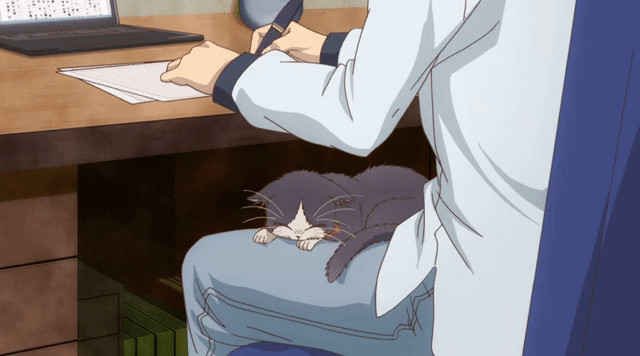

<h1 align="center"><strong>Hey, I'm Kalinga!</strong></h1>
<h4 align="center">yup, living the batak life.</h4>

 

 

 

<ul>
	<li style="list-style:none;color:white">
		<!-- <b> -->
		🍁 It's all about <i><strong>aesthetics</strong></i>.
		<!-- </b> -->
	</li>
	<li style="list-style:none;">
		<!-- <b> -->
		🌻 Currently working on <strong>UI/UX</strong>.
		<!-- </b> -->
	</li>
	<li style="list-style:none;">
		<!-- <b> -->
		💙 Trying to learn <strong>Django</strong> & <strong>Javascript</strong>.
		<!-- </b> -->
	</li>
	<li style="list-style:none;">
		<!-- <b> -->
		🌿 If you like memes, we're already friends.
		<!-- </b> -->
	</li>
	<li style="list-style:none;">
		<!-- <b> -->
		🕊️ Email at <a href="mailto:kalingakhatua@gmail.com">kalingakhatua@gmail.com</a>
		<!-- </b> -->
	</li>
</ul>

 
<h3 align="left"><strong>Connect with me at :</strong></h3>

	<a class="icons" href="https://linkedin.com/in/kalingakhatua" target="_blank">ㅤ</a>
	<a class="icons" href="https://instagram.com/kalinga._" target="_blank">ㅤ</a>
	<a class="icons" href="https://www.codechef.com/users/iamkcube" target="_blank">ㅤ</a>
	<a class="icons" href="https://www.hackerrank.com/iamkcube" target="_blank">ㅤ</a>

<!--   -->
<h3 align="left"><strong>Languages and Tools:</strong></h3>

	<a class="icons2" href="https://getbootstrap.com" target="_blank" rel="noreferrer">
		ㅤ
	</a>
	<a class="icons2" href="https://www.cprogramming.com/" target="_blank" rel="noreferrer">
		ㅤ
	</a>
	<a class="icons2" href="https://www.w3schools.com/css/" target="_blank" rel="noreferrer">
		ㅤ
	</a>
	<a class="icons2" href="https://www.djangoproject.com/" target="_blank" rel="noreferrer">
		ㅤ
	</a>
	<a class="icons2" href="https://www.figma.com/" target="_blank" rel="noreferrer">
		ㅤ
	</a>
	<a class="icons2" href="https://flask.palletsprojects.com/" target="_blank" rel="noreferrer">
		ㅤ
	</a>
	<a class="icons2" href="https://git-scm.com/" target="_blank" rel="noreferrer">
		ㅤ
	</a>
	<a class="icons2" href="https://www.w3.org/html/" target="_blank" rel="noreferrer">
		ㅤ
	</a>
	<a class="icons2" href="https://developer.mozilla.org/en-US/docs/Web/JavaScript" target="_blank" rel="noreferrer">
		ㅤ
	</a>
	<a class="icons2" href="https://www.photoshop.com/en" target="_blank" rel="noreferrer">
		ㅤ
	</a>
	<a class="icons2" href="https://www.python.org" target="_blank" rel="noreferrer">
		ㅤ
	</a>
	<a class="icons2" href="https://reactjs.org/" target="_blank" rel="noreferrer">
		ㅤ
	</a>
	<a class="icons2" href="https://tailwindcss.com/" target="_blank" rel="noreferrer">
		ㅤ
	</a>

 
 
